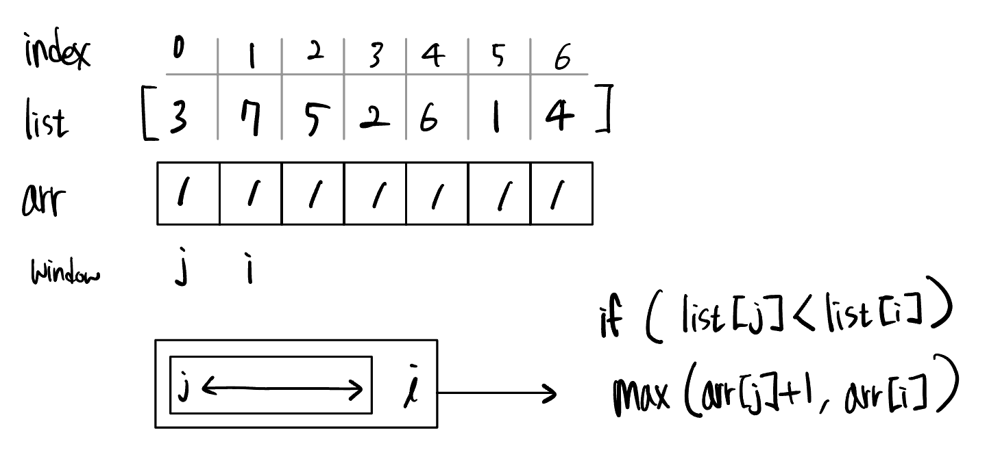

# LIS

## LIS란?

- 최장 증가 부분 수열(Longest Increasing Subsequence)
- **가장 긴 증가하는** 부분 수열을 의미한다.

### 분류

동적 프로그래밍 (Dynamic Programming)

### 예시

- 배열 [3, 7, 5, 2, 6, 1, 4]에서 LIS는 [3, 5, 6]이 될 수 있으며, 길이는 3이다.
- 하나의 수열에서 LIS는 여러 개가 존재할 수 있다.
  예를 들어, 수열 [3, 10, 1, 2, 20]의 경우 [3, 10, 20]와 [1, 2, 20]로 같은 길이의 LIS가 2개 존재한다.

## 문제 풀이 방법

각 위치 `i`에 대해, `i`보다 작은 모든 `j`에 대해 `list[i]`를 갱신한다.
여기서 `list[i]`는 i번째 원소를 마지막으로 사용할 때의 최대 증가 부분 수열의 길이이다.

- 시간 복잡도: O(N^2)

### 이분 탐색과 함께 하기

- 시간 복잡도: O(NlogN)

## 참고 링크

